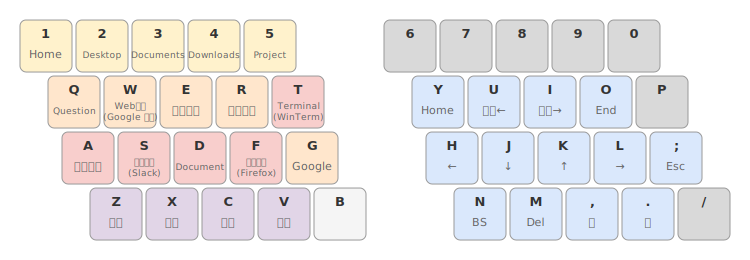

# muhenkan-switch

無変換キーと同時押しを起点としたクロスプラットフォーム・ショートカットツール。

[kanata](https://github.com/jtroo/kanata) + Rust製バイナリ で実装しています。

## 対応環境

| OS | 対応状況 | 備考 |
|----|----------|------|
| Windows 10/11 | ✅ 検証済み | |
| Linux (X11) | ✅ 検証済み | Ubuntu / Debian / Fedora 等の主要ディストリビューションで動作。Wayland は一部機能が非対応 |
| macOS | ⚠️ 未検証 | JIS配列Mac向け設定ファイルを同梱。動作報告歓迎 |

**日本語キーボード（JIS配列）が必須です。** US配列には対応していません。

## デモ

選択したテキストで Web 検索:


ワンキーで指定アプリを最前面に:


## 機能

無変換キーを押しながら他のキーを押すことで、以下の操作ができます。

- **Vim風カーソル移動**: H/J/K/L → ←/↓/↑/→
- **単語・行頭行末移動**: U/I → 単語移動、Y/O → Home/End
- **削除**: N → BackSpace、M → Delete
- **ESC**: ; → Escape
- **アプリ切り替え**: A/S/D/F/T → 指定アプリを最前面に（デフォルト設定、変更可）
- **Web検索**: Q/W/E/R/G → 選択テキストで辞書・翻訳・キーワード検索（デフォルト設定、変更可）
- **フォルダオープン**: 1/2/3/4/5 → Home/Desktop/Documents 等（デフォルト設定、変更可）
- **プレーンテキスト貼り付け / ファイルリネーム**: V → テキスト入力時はクリップボードを書式除去して貼り付け、ファイルマネージャ上ではファイル更新日時でリネーム
- **タイムスタンプ入力 / ファイル複製**: C → テキスト入力時はタイムスタンプ入力、ファイルマネージャ上ではタイムスタンプ付きで複製
- **タイムスタンプ除去 (ファイル名)**: X → ファイルマネージャ上でファイル名からタイムスタンプを除去
- **タイムスタンプ位置切替**: Z → position (before/after) をトグル
- **句読点切替**: カンマ/ピリオド → 4 パターン (`、。` / `，．` / `，。` / `、．`) から設定で選択
- **GUI 設定ウィンドウ**: F1 → 設定ウィンドウを最前面に表示



詳細は [docs/design.md](docs/design.md) を参照してください。

## セットアップ

### Windows

[最新リリース](https://github.com/kimushun1101/muhenkan-switch/releases/latest) から
`muhenkan-switch_<バージョン>_x64-setup.exe` をダウンロードしてインストール。
スタートメニューから `muhenkan-switch` を起動してください。

> 上記を自動で実施するスクリプトは以下のとおりです。PowerShellにコマンドを入力してください。
> ```powershell
> irm https://raw.githubusercontent.com/kimushun1101/muhenkan-switch/main/scripts/install/get.ps1 | iex
> ```

### Linux / macOS

```bash
curl -fsSL https://raw.githubusercontent.com/kimushun1101/muhenkan-switch/main/scripts/install/get.sh | sh
```

Linux ではアプリ一覧（Super キー）または Dock から `muhenkan-switch` を起動できます。
macOS ではターミナルから `muhenkan-switch` を実行してください。

無変換キーを押しながら H/J/K/L でカーソルが移動すれば成功です。

手動インストール・追加設定・アンインストール・更新等の詳細は [docs/setup.md](docs/setup.md) を参照してください。

## 使い方・Tips

設定画面のキーボードショートカット、シナリオ別の使い方、トラブルシューティング、FAQ は [docs/tips.md](docs/tips.md) を参照してください。

## カスタマイズ

検索エンジン URL、アプリ名、フォルダパス、キー割り当て等は GUI（システムトレイ → 設定）から変更できます。
起動キーの変更や配列の組み替え等、キーマッピング本体のカスタマイズも上級者向けに対応しています（kanata の構文知識が前提）。

詳細とデフォルトのキー割り当ては [docs/customize.md](docs/customize.md) を参照してください。

## 開発

[docs/development.md](docs/development.md) を参照してください。

## ライセンス

LGPL-3.0-only

同梱する kanata も LGPL-3.0 です（`LICENSE` 参照）。

## 旧版（AutoHotkey版）

Windows 専用の AutoHotkey 版は [muhenkan-switch-ahk](https://github.com/kimushun1101/muhenkan-switch-ahk) にあります。
