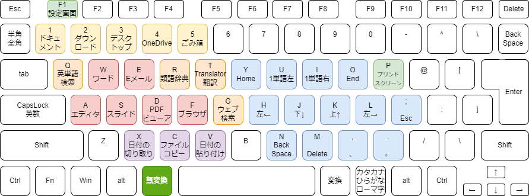
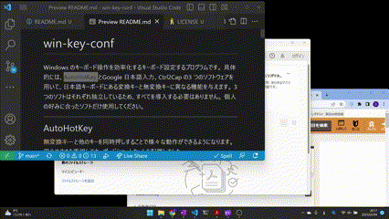
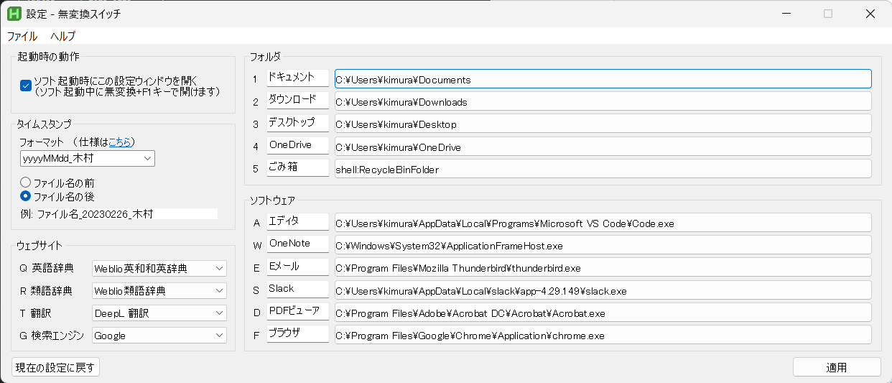

# muhenkan-switch

`無変換キー`と他のキーを同時押しすることで様々な動作ができるようになります。
`無変換キー`単体は`無変換キー`として効きます。
現状の機能を消すことなく、覚えやすさを重視してキーボードショートカットを配置しました。

## インストール
1. [GitHub のリリース](https://github.com/kimushun1101/muhenkan-switch/releases)からzip ファイルをダウンロード。
2. ユーザの書き込み権限があるところに展開。  
(例えばC:\Users\ユーザ名以下であればお好みのフォルダの中に入れられます。入れては行けない場所としてはC:\Program Files など。)
3. muhenkan.exe を実行。これはインストーラではなくソフト本体です。

## できること
 

- `無変換キー`+`左手`（右手はマウスを操作していることを想定）
  - (緑) `F1`: [設定の変更](#設定変更) を行うウィンドウを表示
  - (黄) 数字キー→エクスプローラーでフォルダを開く ***[【設定変更可能】](#設定変更)***
    - `1`: ドキュメント
    - `2`: ダウンロード
    - `3`: デスクトップ
    - `4`: OneDrive
    - `5`: ごみ箱
  - (橙) 左手上段→選択文字列を検索 ***[【サイトは変更可能】](#設定変更)***
    - `Q`: 英単語検索
    - `R`: 類語辞典
    - `T`: 翻訳（Translator）
    - `G`: Web 検索
  - (赤) 左手中段→ソフトを最前面に出す ***[【設定変更可能】](#設定変更)***
    - `A`: エディタ
    - `W`: ワード
    - `E`: Eメール
    - `S`: スライド（パワーポイント）
    - `D`: PDF ビューア（ドキュメント閲覧）
    - `F`: ブラウザ
  - (紫) 左手下段→ファイルの操作
    - `V`: ファイル名に最後に編集した日付のタイムスタンプを貼り付け
    - `C`: コピーして、新しくできたファイルの名前に最後に編集した日付のタイムスタンプ貼り付け
    - `X`: タイムスタンプの切り取り
- (青) `無変換キー`+`右手`（両手がホームポジションにあることを想定）
  - `H`, `J`, `K`, `L`: 1文字カーソル移動
  - `U`, `I`: 単語で左右カーソル移動
  - `Y`, `O`: Home、End カーソル移動
  - `N`, `M`, `;` BackSpace, Delete, Esc
  - `,`, `.` カンマピリオドで句読点(、, 。) を入力（IMEで`．`と`，`にセットしている人は助かるかも） 
- 上記のルールから外れるもの
  - `Ctrl` + `Shift` + `V` : 書式なしで貼り付け（エディタソフトは除く）
  - 下表に示すタイピング後にEnter やSpace キーを押すとその文字が置換される

| タイピング  | 置換入力例      | 
| ---------- | -------------- | 
| ;date      | 20230225       | 
| ;dateu     | 2023_0225      | 
| ;dates     | 2023/02/25     | 
| ;dated     | 2023.02.25     | 
| ;time      | 1605           | 
| ;timec     | 16:06          | 
| ;datetime  | 20230225_1602  | 

### 選択文字列を検索

### ソフトを最前面に出す(ソフトの切り替え)

## キーの覚え方
- Web サイトやソフトはおおよそ推測できる割当になっているかと思います。例外としては以下のとおりです。
  - 英単語=`Q` はQuestion から連想します。
  - エディタ=`A` はAtom を使っていたからです。
  - ブラウザ=`F` はFireFox を使っていたからです。
- タイムスタンプの操作=`XCV` は、切り取り、コピー、ペーストなどを連想して覚えてください。
- カーソル移動=`HJKL` はVim 準拠
- カーソル移動=`YUIO` はキーの位置と横移動の大きさを関連付けています。
- 文字消去=`NM` は両方とも人差し指で操作する。位置関係はカーソルが動く方向に対応しています。

## 設定変更

1. `muhenkan.exe` を実行する。
2. `無変換キー`+`F1` で設定画面が開き、設定の確認と変更ができる。
- 起動時の動作：チェックボックスにチェックを入れていると有効になります。
- タイムスタンプ：フォーマットと位置を編集できます。
- ウェブサイト：ドロップダウンリストから選択できます。好みのウェブサイトが選択肢にない場合には追加しますので教えてください。
- フォルダ：テキストボックスは好みに合わせて変更可能です。パスはクリックすると変更できます。
- ソフトウェア：テキストボックスは好みに合わせて変更可能です。ソフトをクリックすると、現在起動中のソフトの一覧がでて、そこから変更したいソフトを選ぶことができます。
- 適用：現在表示している内容に設定を変更します。上記を変更しただけでは設定の反映はされません。
- 現在の設定に戻す：設定画面上の変更をリセットして現在の設定項目に直します。
- メニューバーのファイル：バックアップの作成と読み込み、初期設定へ戻すことができます。またこのソフトの終了もここから行えます。設定画面を閉じただけでは、ソフトは終了されません。
- メニューバーのヘルプ：この説明を見ることができます。また、このソフトの最新版がリリースされているか確認できます。

## アンイストール
1. `uninstall.exe` を実行。
2. `uninstall.exe` を含むフォルダごと削除。

---

## ライセンス
公式のサンプルを参考にしているため、GNU GPLv2 とします。
- AutoHotKey : [https://www.autohotkey.com/docs/v2/license.htm](https://www.autohotkey.com/docs/v2/license.htm)
