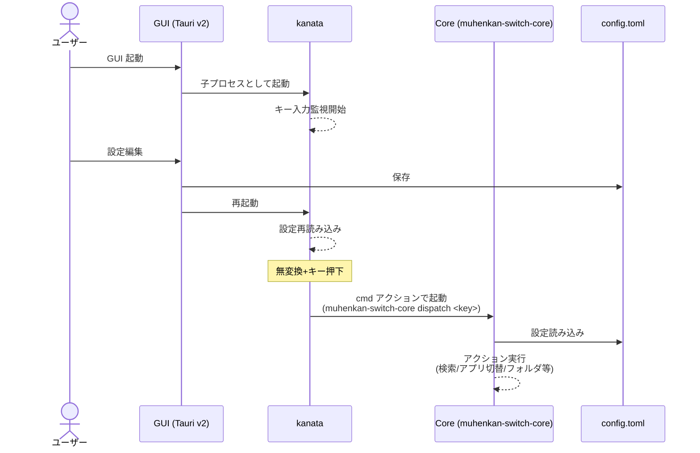
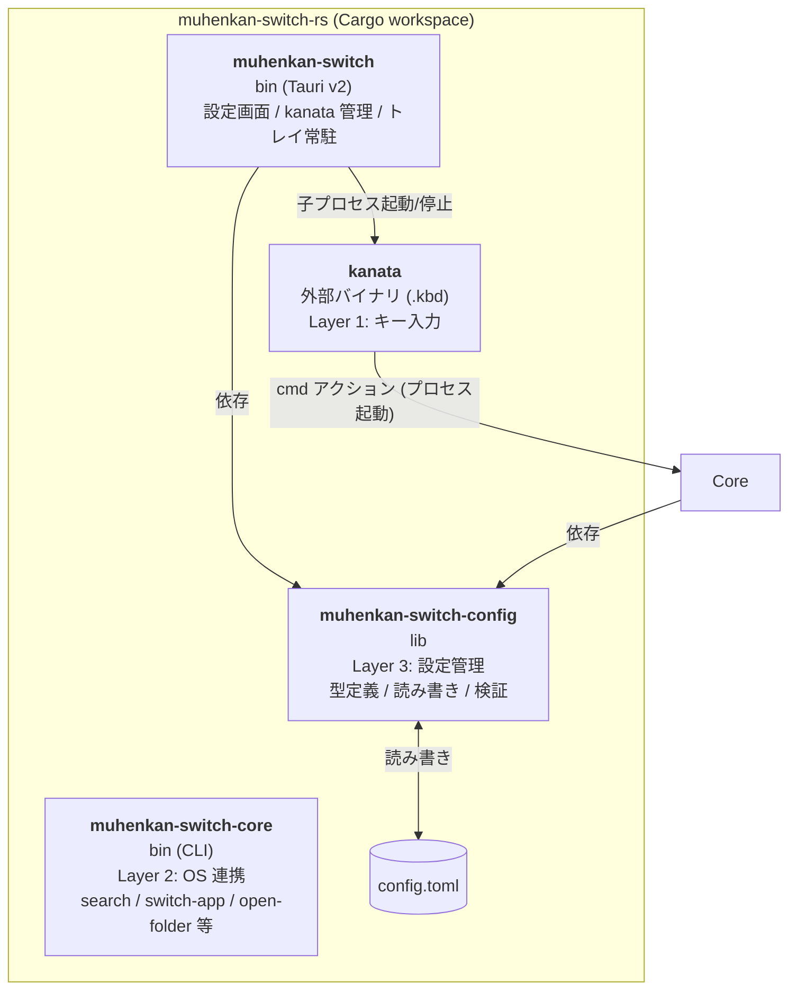

## 概要

現行の `muhenkan-switch`（AutoHotkey v2、Windows専用）をマルチプラットフォーム化する。

**アーキテクチャ:** kanata（既存OSSキーリマッパー）＋ Rust製 muhenkan-switch バイナリ ＋ Tauri v2 GUI

**前提条件:**
- 対象OS: Windows / macOS / Linux
- macOS は設定ファイルを提供するが、**開発者の検証環境がないため未検証**
- **JIS配列キーボード前提**。US配列は考慮しない
- ライセンス: LGPL-3.0-only

**設計方針:**
- kanata を外部バイナリとして利用（クレート組み込みはしない）
- kanata と muhenkan-switch は `cmd` アクション（プロセス起動）で疎結合に接続
- muhenkan-switch は非同期なし・ライフタイム注釈なしのシンプルな Rust コード（Windows の Win32 API 呼び出しのみ unsafe を使用）
- GUI は Tauri v2 + vanilla JS（Node.js ビルドステップなし）で設定の閲覧・編集を提供

---

## 現行機能の分類と実装方針

### Layer 1: キー入力のインターセプト → kanata に委譲

| 機能 | kanata での実現 |
|------|----------------|
| 無変換キーの tap/hold 判定 | `tap-hold` アクション |
| 無変換+X → 別キー出力 | レイヤー定義 |
| HJKL → カーソル移動 | レイヤー内で `left` `down` `up` `right` |
| YUIO → 単語移動/行頭行末 | レイヤー内マクロ |
| NM → BackSpace/Delete | レイヤー内で `bspc` `del` |
| ; → ESC | レイヤー内で `esc` |
| カンマ・ピリオド → 句読点（、。） | `(unicode 、)` / `(unicode 。)` |

### Layer 2: OS連携 → muhenkan-switch バイナリ（Rust）

| 機能 | 実装方針 |
|------|----------|
| アプリ切り替え | OS別: Win32 API (`windows` クレート) / wmctrl / osascript(未検証) |
| フォルダオープン | `open` クレート |
| 選択文字列 → Web検索 | `arboard`（クリップボード） + `webbrowser`（ブラウザ起動） |
| タイムスタンプ / プレーンコピー | V: テキスト時は `chrono` で現在日時を生成し、Windows は `SendInput` で直接入力、Linux はクリップボード経由で貼り付け（IME 全角化を回避）。ファイルマネージャ上ではファイル更新日時でリネーム。C: テキスト時は `Ctrl+C` → `arboard` でプレーンテキスト化、ファイルマネージャ上ではタイムスタンプ付き複製。X: ファイルマネージャ上でタイムスタンプ除去（テキスト時は no-op） |
| スクリーンショット | OS別コマンド呼び出し |

### Layer 3: 設定管理 → muhenkan-switch が config.toml を読み込み

- `toml` + `serde` で設定ファイルを構造体にデシリアライズ
- `toml_edit` を使用し、コメントを保持したまま保存
- 検索URL、アプリ名、フォルダパス、タイムスタンプ形式を設定可能
- 各エントリに割当キー (`key`) を設定可能。保存時はキー順でソート（キーなしは末尾）
- バリデーション: タイムスタンプ形式・位置、検索URL の `{query}` プレースホルダ、割当キーの重複チェック（セクション横断）

---

## アーキテクチャ図

### 実行時のフロー

ユーザーが操作するのは GUI のみ。GUI が kanata を子プロセスとして起動し、kanata がキー押下時に CLI を呼び出す。



### コンポーネント構成



### Cargo ワークスペース構成

リポジトリは 3 つのクレートからなる Cargo ワークスペースで構成される。

| クレート | 種別 | 役割 |
|---------|------|------|
| `muhenkan-switch` | bin (Tauri) | **ユーザーが直接起動する唯一のアプリ**。config.toml の閲覧・編集 UI を提供し、kanata を子プロセスとして起動・停止・再起動する。システムトレイに常駐 |
| `muhenkan-switch-core` | bin | kanata から `cmd` アクションで呼び出される**実行エンジン**。search, switch-app, open-folder, timestamp, screenshot, dispatch サブコマンドを提供。ユーザーが直接起動することはない |
| `muhenkan-switch-config` | lib | 設定の型定義 (`Config`, `AppEntry` 等)、config.toml の読み書き (`load`/`save`)、バリデーション、割当キー解決。GUI と CLI の**両方から依存される共有ライブラリ** |

**3 つのクレートが独立している理由:**

- **GUI → kanata → CLI** という実行時フローにおいて、GUI と CLI は別プロセスとして動作するため、それぞれ独立したバイナリクレートが必要
- **config クレート** は設定の型・読み書き・検証ロジックを GUI と CLI で共有するために独立クレートとして切り出している。どちらか一方に置くと、もう片方がバイナリクレート全体に依存するか、コードを複製する必要が生じる

---

## CLI 仕様

```
muhenkan-switch-core <COMMAND> [OPTIONS]

Commands:
  dispatch     <KEY>              割当キーに対応するアクションを実行
  search       --engine <NAME>    選択テキスト（クリップボード）をWeb検索
  switch-app   --target <NAME>    指定アプリを最前面に
  open-folder  --target <NAME>    指定フォルダを開く
  timestamp    --action <ACTION>  タイムスタンプ操作 (paste|copy|cut)
  open-gui                        GUI 設定ウィンドウを前面に出す
```

設定は実行ファイルと同じディレクトリの `config.toml` から読み込む。

`dispatch` は kanata の `.kbd` ファイルから呼ばれる汎用エントリポイント。キーを受け取り、config.toml の各エントリの `key` フィールドを search → folders → apps の順に走査して対応するアクション（search / open-folder / switch-app）を実行する。これにより kbd ファイルはキー割り当ての詳細を持たず、全ての対応関係を config.toml で管理できる。

---

## kanata プロセス管理

GUI (Tauri) から kanata プロセスの開始・停止・再起動を行う。

- **再起動の用途:** kanata は `.kbd` 設定ファイルの変更を自動検知しないため、設定編集後に再起動して反映する
- バイナリ探索は exe 同梱ディレクトリ → カレントディレクトリ → ワークスペースルートの順にフォールバック
- **子プロセス自動終了 (Windows):** Job Object (`JOB_OBJECT_LIMIT_KILL_ON_JOB_CLOSE`) を使用し、GUI プロセス終了時に kanata を OS レベルで自動終了させる

---

## 無変換キーのOS間対応

| OS | kanata キー名 | 備考 |
|----|--------------|------|
| Windows | `muhenkan` | VK 0x1D。JISキーボードで正常認識 |
| Linux | `muhenkan` | evdev `KEY_MUHENKAN` (keycode 102) |
| macOS | `eisu` (推定) | JIS配列Macの「英数」キー。**未検証** |

---

## 使用クレート

| 用途 | クレート | バージョン |
|------|---------|-----------|
| CLI引数パース | `clap` (derive) | 4.x |
| クリップボード | `arboard` | 3.x |
| ブラウザ起動 | `webbrowser` | 1.x |
| ファイル/フォルダオープン | `open` | 5.x |
| TOML読み込み | `toml` + `serde` | 0.8.x / 1.x |
| TOML書き込み (コメント保持) | `toml_edit` | 0.22.x |
| 順序付きマップ | `indexmap` | 2.x |
| 子プロセス共有 | `shared_child` | 1.x |
| Job Object (Windows) | `windows` | 0.61.x |
| 日時処理 | `chrono` | 0.4.x |
| URLエンコード | `urlencoding` | 2.x |
| エラーハンドリング | `anyhow` | 1.x |

---

## ビルドとリリース

- GitHub Actions で Windows (x64) / Linux (x64) / macOS (x64, aarch64) のバイナリを自動ビルド
- タグ push (`v*`) でリリース作成
- リリース zip には muhenkan-switch バイナリ + .kbd + config.toml を同梱
- kanata 本体は同梱またはダウンロードリンクを案内

---

## キー割り当ての設計思想

### 無変換キー中心の設計

muhenkan-switch は**無変換キーを左手親指で押しながら**他のキーを押す操作体系である。この名前自体が設計思想を表している。

#### 基本原則: 左手ディスパッチ / 右手テキスト編集

```
┌─────────────────────────────────────────────────────────┐
│  JIS キーボード（無変換レイヤー）                          │
│                                                         │
│  ┌─────────────────────┐  ┌─────────────────────────┐   │
│  │      左手領域        │  │       右手領域           │   │
│  │  コンテキスト切替    │  │    テキスト編集          │   │
│  │  （片手操作を想定）  │  │  （両手操作を想定）      │   │
│  └─────────────────────┘  └─────────────────────────┘   │
│                                                         │
│           [無変換] ← 左手親指で押下                       │
└─────────────────────────────────────────────────────────┘
```

**左手: コンテキスト切替（右手はマウスの可能性あり）**

ユーザーがマウスで作業中に、左手だけで以下を実行する想定:

- **アプリ切替**: 無変換+f でブラウザ、無変換+a でエディタ、等
- **Web 検索**: テキスト選択後、無変換+g で Google 検索
- **フォルダオープン**: 無変換+1 で Downloads、等
- **タイムスタンプ / クリップボード操作**: 無変換+v/c/x

これらは**右手がマウス上にあっても左手だけで完結**する。ブラウザで調べものをしながらエディタに戻る、ファイルをダウンロードしてフォルダを開く、といったワークフローに最適化されている。

**右手: テキスト編集（両手がキーボード上）**

タイピング中は両手がキーボード上にある。右手は Vim 風の操作で**ホームポジションから手を動かさずに**テキスト編集を行う:

- **カーソル移動**: h/j/k/l（Vim 配置）
- **単語・行移動**: u/i（単語左右）、y/o（行頭・行末）
- **削除**: n（BackSpace）、m（Delete）
- **エスケープ**: ;
- **句読点**: ,/. → 4パターンから選択（config.toml の `punctuation_style` で切替）

### なぜ変換キーは使わないのか

変換キーは右手親指で押す。しかし:

1. **右手がマウス上のとき**: 変換キーが押せない。左手のキーを使うことになるが、それは無変換キーで既にカバーしている
2. **両手がキーボード上のとき**: 変換キーを右手親指で押しながら左手で操作することは可能だが、それは無変換キーの左手操作と重複する
3. **学習コストの増加**: 2つの修飾キーに異なる機能を割り当てると、覚えるべき組み合わせが倍増する

つまり、変換キーに割り当てを追加しても**無変換キーで既にできることの重複**になるか、**学習コストに見合わない機能追加**になる。無変換キー1つに集約することで、シンプルさを維持している。

### キーボード配置の詳細

#### 左手: 割当キー + 固定アクション

```
  [1][2][3][4][5]         ← フォルダ (dispatch)
    [q][r][t]  [g]        ← 検索 (dispatch)
     [a] [w][e][s][d][f]  ← アプリ + 検索 (dispatch)
     [z] [x][c][v] [b]    ← タイムスタンプ (固定) + 追加 dispatch
```

| 種別 | キー | 備考 |
|------|------|------|
| dispatch (config.toml で自由に割当) | 1-5, q, r, t, g, a, w, e, s, d, f, b | 検索・フォルダ・アプリに使用 |
| 固定アクション | v (ts-paste), c (ts-copy), x (ts-cut) | タイムスタンプ操作（C はテキスト時プレーンコピー） |
| 未使用 | z | 将来の拡張用 |

#### 右手: テキスト編集（固定）

```
    [y][u][i][o]   [p:空き]
     [h][j][k][l]  [;:Esc]
      [n][m]  [,:、] [.:。]
```

| カテゴリ | キー | 割当 | 備考 |
|---------|------|------|------|
| カーソル移動 | h, j, k, l | ←, ↓, ↑, → | Vim 配置 |
| 単語移動 | u, i | Ctrl+←, Ctrl+→ | |
| 行移動 | y, o | Home, End | |
| 削除 | n, m | BackSpace, Delete | 物理キーが遠いため muhenkan に価値あり |
| エスケープ | ; | Esc | 物理キーが遠いため muhenkan に価値あり |
| 句読点 | , . | 、。 / ，． / ，。 / 、．  | config.toml の `punctuation_style` で切替 |
| 空き | p | （未割り当て） | スクリーンショットを廃止（#28） |

### 割り当てるべき操作の基準

muhenkan レイヤーに載せる価値があるのは、以下の条件を**両方**満たす操作:

1. **物理キーがホームポジションから遠い**（BackSpace, Delete, Esc, 矢印キーなど）
2. **使用頻度が高い**

Ctrl+Z / Ctrl+Y / Ctrl+F は条件1を満たさない（Ctrl は左手小指で押せる位置にあり、ホームポジションからの逸脱が小さい）。スクリーンショットは条件2を満たさない。

これらは OS 標準のショートカットに委ね、muhenkan レイヤーは**本当にホームポジションを崩す操作**に集中する。

---

## UI 設計リファレンス

### メニュー・ヘルプ構成

- [メニューバー徹底解説](https://it-notes.stylemap.co.jp/programs/the-ultimate-guide-to-menu-bars/) — メニューバーの一般的な項目構成
- [Oracle CDE スタイルガイド — メニュー・バー](https://docs.oracle.com/cd/E19683-01/816-4039/cdechk-58/index.html) — ファイル/編集/表示/ヘルプの標準構成
- [Microsoft — Windows 7 メニュー設計ガイドライン](https://learn.microsoft.com/ja-jp/windows/win32/uxguide/cmd-menus) — ヘルプメニューの標準項目

### アイコン設計・生成

- [App Icons | Tauri v2](https://v2.tauri.app/develop/icons/) — Tauri v2 のアイコン仕様と `tauri icon` コマンドの使い方
- [Command Line Interface — icon | Tauri v2](https://v2.tauri.app/reference/cli/#icon) — `tauri icon [INPUT]` の入力形式（PNG/SVG、正方形必須）と生成ファイル一覧
- [draw.io CLI export](https://www.drawio.com/blog/export-diagrams) — draw.io デスクトップアプリの `--export` フラグによる SVG エクスポート（クロスプラットフォーム対応）

### タイムスタンプ・ファイル命名

- [Harvard Library — File Naming Best Practices](https://guides.library.harvard.edu/c.php?g=1033502&p=7496710) — タイムスタンプフォーマットの参考
- [UConn — File Naming and Date Formatting](https://guides.lib.uconn.edu/c.php?g=832372&p=8226285)
- [ISO 8601 — Wikipedia](https://en.wikipedia.org/wiki/ISO_8601) — 日付フォーマットの国際標準
- [ファイル名に日付をつけるときのルール](https://hokodate-eiichilaw.com/revival/work65) — 日本語圏での命名慣習

### 自動更新 (tauri-plugin-updater)

- [Tauri v2 Updater Plugin](https://v2.tauri.app/plugin/updater/) — 公式ドキュメント
- [tauri-plugin-updater crate](https://crates.io/crates/tauri-plugin-updater) — crates.io

#### Windows のみ自動更新とした理由

- Windows ユーザーはインストーラー (.msi / NSIS) 経由で導入するため、アプリ内で完結する自動更新が UX として自然
- Linux / macOS ユーザーはコマンドライン経由（`curl | sh`）でインストールするパワーユーザーが多く、スクリプト更新の方が馴染みやすい
- Linux / macOS 向けの Tauri updater は AppImage / DMG 形式が前提であり、現在の配布形態（tar.gz）とは合わない（詳細は以下）

#### AppImage (Linux) を採用しない理由

- **sidecar バイナリの破損リスク** — linuxdeploy が ELF の rpath を `$ORIGIN/../lib` に書き換えるため、kanata_cmd_allowed 等の sidecar が壊れる既知バグ（[tauri#11898](https://github.com/tauri-apps/tauri/issues/11898), [tauri#5445](https://github.com/tauri-apps/tauri/issues/5445)、upstream 未修正）。回避には AppImage 展開→バイナリ差替→再パックが必要
- **設定ファイルの永続化** — AppImage は読み取り専用ファイルシステム。config.toml や muhenkan.kbd を exe_dir に置く現行設計は使えず、XDG ディレクトリへの移行が必要
- **kanata の権限設定が依然必要** — uinput グループ追加 + udev ルール作成にはシステムレベルの設定が必要で、AppImage の「DL して即実行」のメリットが薄い
- **FUSE 依存** — Ubuntu 24.04+ / Fedora 39+ では libfuse2 が標準搭載されておらず、別途インストールが必要
- **バンドルサイズ** — GTK/WebKitGTK を同梱するため 70 MB 超。sidecar 含めると 100 MB 超になる可能性

#### DMG/.app バンドル (macOS) を採用しない理由

- **Apple Developer Program の年間費用** — コード署名 + 公証（notarization）には $99/年の Developer ID 証明書が必須（[Apple Developer Program](https://developer.apple.com/programs/enroll/)）。署名なしだと「開発元が未確認」ダイアログが表示される
- **更新時の権限リセット** — 署名なし or 署名変更時、macOS が Input Monitoring 権限をリセットし kanata が動作不能に（[tauri#10567](https://github.com/tauri-apps/tauri/issues/10567)）。ユーザーが毎回手動で System Settings から再付与する必要がある
- **sidecar の署名・公証** — .app バンドル内の全バイナリを同一証明書で署名する必要あり。サードパーティ製の kanata バイナリも自分の証明書で署名が必要（[tauri#11992](https://github.com/tauri-apps/tauri/issues/11992)）
- **Universal Binary 要件** — Intel (x86_64) + Apple Silicon (aarch64) の両方をサポートするには、sidecar も含めて universal binary 化（lipo）が必要
- **設定ファイルの永続化** — .app バンドル内は読み取り専用。config.toml 等は `~/Library/Application Support/` に移す再設計が必要

#### MSI をやめて NSIS のみにした理由

- **未署名 MSI はポリシーでブロックされる** — Windows のグループポリシーにより「システム管理者によって、ポリシーはこのインストールを実行できないように設定されています」と表示され、インストールできない環境がある
- **署名にはコード署名証明書が必要** — OV 証明書で $70〜200/年、EV 証明書で $200〜500/年。OSS 向け無料の [SignPath.io](https://signpath.io/) もあるが審査が必要
- **MSI が好まれるのは企業一括配布（SCCM/Intune）だが、その場合も署名済みが前提** — 未署名 MSI を配布するメリットはほぼない
- **NSIS はポリシー制限を受けにくい** — SmartScreen 警告は出るが、「詳細情報」→「実行」で通る

### 配布形態の参考リンク

- [Tauri v2 AppImage docs](https://v2.tauri.app/distribute/appimage/)
- [Tauri v2 macOS Code Signing](https://v2.tauri.app/distribute/sign/macos/)
- [Tauri v2 macOS Application Bundle](https://v2.tauri.app/distribute/macos-application-bundle/)
- [kanata Linux setup](https://github.com/jtroo/kanata/blob/main/docs/setup-linux.md)
- [kanata — Avoid using sudo on Linux](https://github.com/jtroo/kanata/wiki/Avoid-using-sudo-on-Linux)
